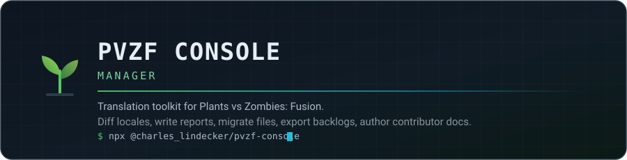

<div align="center">



**One console for the whole *Plants vs Zombies: Fusion* translation workflow.**
Diff every locale against the source, write per-locale reports, rebuild the tip and buff
files, catch duplicates, export a Trello backlog, and turn the weekly PR recap into
contributor documentation.

[**npm**](https://www.npmjs.com/package/@charles_lindecker/pvzf-console) ·
[**Docs**](docs/) ·
[**Supported files**](docs/catalog.md) ·
[**Architecture**](docs/architecture.md) ·
[**Contributing**](CONTRIBUTING.md)

[](https://github.com/LINDECKER-Charles/PVZ-Fuzion-ConsolManager/actions/workflows/ci.yml)
[](https://github.com/LINDECKER-Charles/PVZ-Fuzion-ConsolManager/actions/workflows/security.yml)
[](https://github.com/LINDECKER-Charles/PVZ-Fuzion-ConsolManager/actions/workflows/ci.yml)
[](https://github.com/LINDECKER-Charles/PVZ-Fuzion-ConsolManager/actions/workflows/security.yml)
[](https://github.com/LINDECKER-Charles/PVZ-Fuzion-ConsolManager/actions/workflows/security.yml)
[](.github/dependabot.yml)

[](https://www.npmjs.com/package/@charles_lindecker/pvzf-console)
[](https://www.npmjs.com/package/@charles_lindecker/pvzf-console)
[](https://nodejs.org/)
[](https://www.typescriptlang.org/)
[](https://vitest.dev/)
[](vitest.config.ts)
[](docs/usage.md)
[](LICENSE)

[](docs/catalog.md)
[](docs/catalog.md)
[](package.json)
[](https://github.com/sponsors/LINDECKER-Charles)
[](https://ko-fi.com/charleslindecker)
[](https://github.com/LINDECKER-Charles/PVZ-Fuzion-ConsolManager/stargazers)

</div>

---

## Quick start

```bash
npx @charles_lindecker/pvzf-console                      # interactive console
npx @charles_lindecker/pvzf-console diff --lang French   # headless, one locale
```

Run it from a folder that sits next to `PvZ_Fusion_Translator/` and it finds the bundle by
itself. Anywhere else, point it at the folder once in **Settings** — the choice is remembered.
Node 20 or newer is the only requirement.

<details>
<summary>Install it permanently, or run it from source</summary>

```bash
npm install -g @charles_lindecker/pvzf-console   # global `pvzf-console` command

git clone https://github.com/LINDECKER-Charles/PVZ-Fuzion-ConsolManager.git
cd PVZ-Fuzion-ConsolManager && npm install
npm run dev                                      # live TUI from source, via tsx
```

</details>

---

## What it does

|   | Tool | What you get |
| --- | --- | --- |
|  | **Show what's missing** | Diffs a locale against the source across [8 categories](docs/catalog.md) and writes one Markdown report per category — each missing entry printed as the exact JSON block to translate. Optional `*_diff.json` for re-injection. |
|  | **Migrate files** | Builds the tip, buff and custom-level files a locale does not have yet, pulling each translation from its own `translation_strings.json`. Never overwrites an existing file. |
|  | **Export & audit** | One Trello-ready CSV per category plus a generated import guide, and a duplicate scanner that catches repeated JSON keys and translations reused across keys. |
|  | **Author the docs** | Splits the weekly translation-PR recap into one Markdown block per contributor, counters included — the lead's *Reviews* block is derived, not typed. |

Everything runs locally: no network call, no telemetry, no account. Two runtime dependencies
([`@clack/prompts`](https://github.com/bombshell-dev/clack), `picocolors`), one bundled file.

---

## Using the console

Move with the arrow keys, confirm with `Enter`, leave any screen with `Esc`.

```text
┌  PVZF CONSOLE
│
◆  Main menu
│  ● Show what's missing   diff locales · write reports
│  ○ Translator tools      migrate · trello · duplicates
│  ○ Documentation         PR recap → contributor docs
│  ○ Settings
│  ○ Exit
└
```

Past ten locales the picker turns into a type-to-filter list, an *All locales* entry runs the
whole set at once, and a cancelled prompt never triggers the action it interrupted.

**Full walkthrough of every screen: [docs/usage.md](docs/usage.md).**

## Using it headlessly

```bash
pvzf-console diff --lang French                          # every category, one locale
pvzf-console diff --lang German --out ./out --with-diff  # custom root + JSON diffs
pvzf-console pr-resume --input recap.md --output docs/contributions.md
```

Exit codes are CI-friendly: `0` success, `1` runtime failure, `2` bad arguments or unknown
locale. Details in [docs/usage.md](docs/usage.md#headless-cli).

---

## Where things land

```text
reports/<Locale>/     missing_*.md · duplicates.md · *_diff.json   (only when non-empty)
exports/<Locale>/     trello_*.csv · trello_README.md
contribution-summary.md
```

A category with nothing to fix writes no file at all, so the output tree is the backlog.
Exact anatomy of every generated artifact: [docs/outputs.md](docs/outputs.md).

---

## Documentation

| Document | What's in it |
| --- | --- |
| [docs/usage.md](docs/usage.md) | Install, every menu screen, the headless commands, exit codes. |
| [docs/catalog.md](docs/catalog.md) | Every file, locale and category the toolkit handles — and what it deliberately ignores. |
| [docs/configuration.md](docs/configuration.md) | Settings reference, where `settings.json` lives, environment overrides. |
| [docs/outputs.md](docs/outputs.md) | The shape of every report, JSON diff, CSV and summary produced. |
| [docs/architecture.md](docs/architecture.md) | Layers, seams, invariants, extension points. |
| [docs/troubleshooting.md](docs/troubleshooting.md) | Symptom → cause → fix. |
| [CONTRIBUTING.md](CONTRIBUTING.md) | Dev setup, code standards, commit convention, how to add a translation type. |
| [SECURITY.md](SECURITY.md) | Threat model, supported versions, private reporting. |
| [Releases](https://github.com/LINDECKER-Charles/PVZ-Fuzion-ConsolManager/releases) | What changed, version by version. |

---

## Security

Every push, every pull request and a weekly schedule run `npm audit` (blocking on high and
critical production advisories), the ESLint security ruleset, Semgrep, Gitleaks over the full
history, and CodeQL with the `security-extended` queries. Found a vulnerability? Report it
privately — [SECURITY.md](SECURITY.md) has the channels and the response targets.

## Contributing

Issues and pull requests are welcome. [CONTRIBUTING.md](CONTRIBUTING.md) covers the dev loop
(`npm run dev`, `npm test`, `npm run typecheck`), the enforced size and complexity limits, and
the four-step drill for adding a new translation category.

## Support

The console is free, MIT-licensed and maintained on personal time. If it saved you an
evening of hand-diffing locale files, you can give something back:

- [**GitHub Sponsors**](https://github.com/sponsors/LINDECKER-Charles) — also reachable from
  the *Sponsor* button at the top of this page.
- [**Ko-fi**](https://ko-fi.com/charleslindecker) — one-off, no account needed.

Starring the repository, filing a precise bug report or sending a locale fix helps just as
much, and costs nothing.

## Credits

**Charles Lindecker** — [@LINDECKER-Charles](https://github.com/LINDECKER-Charles) ·
[charles.lindecker@outlook.fr](mailto:charles.lindecker@outlook.fr)

Thanks to the PvZ Fusion translator community, and to **@cassidy [BLMS]** whose
`migrate.py` / `migrate_odyssey.py` scripts inspired the Translator tools.

## License

[MIT](LICENSE).
