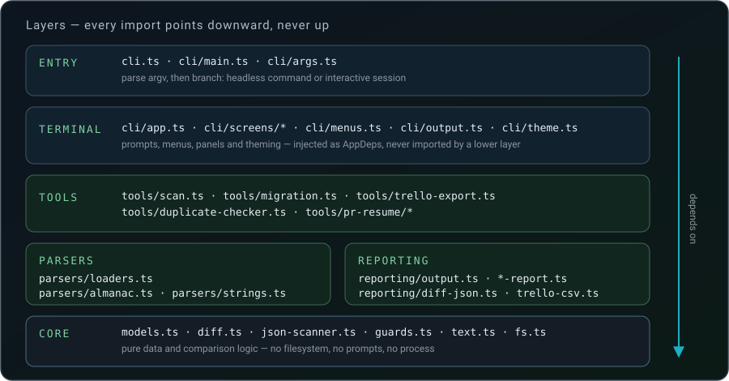
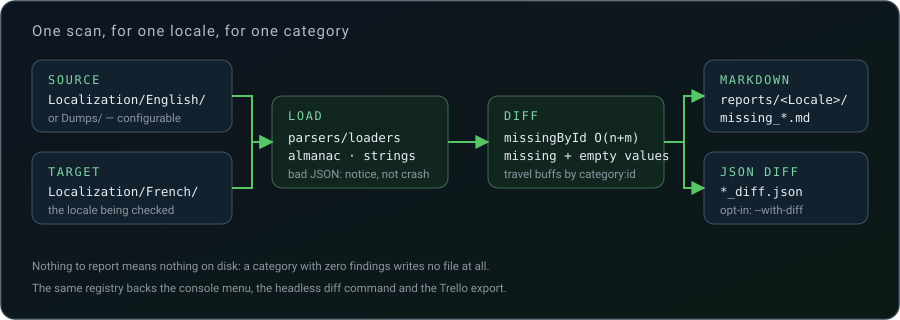

# Architecture

How the toolkit is put together, why it is put together that way, and where to plug new
behaviour in. For the user-facing side see [usage.md](../guide/usage.md); for the data it operates on
see [catalog.md](../guide/catalog.md).

- [Design goals](#design-goals)
- [Layers](#layers)
- [Directory map](#directory-map)
- [The two entry paths](#the-two-entry-paths)
- [The scan pipeline](#the-scan-pipeline)
- [Seams](#seams)
- [Invariants](#invariants)
- [Enforced limits](#enforced-limits)
- [Testing strategy](#testing-strategy)
- [Build and distribution](#build-and-distribution)
- [Extension points](#extension-points)

---

## Design goals

1. **Local-first, no ambient authority.** The tool reads and writes files on the machine it
   runs on. No network, no credentials, no telemetry. Two runtime dependencies, both for the
   terminal UI.
2. **A translator's work is sacred.** Nothing overwrites an existing locale file, nothing is
   written before the user has seen what it will contain, and a cancelled prompt performs no
   action.
3. **One broken file must not take the run down.** Missing and malformed inputs degrade into
   an empty result plus a notice, so a scan over twenty locales survives one bad JSON file.
4. **The terminal is a detail.** Domain code knows nothing about prompts, colours or
   `process`; the whole UI is passed in as data and is replaceable in a test.
5. **Adding a category should be boring.** Categories are descriptors in a registry, not
   hand-written branches — the menu, the headless command and the exports all derive from it.

## Layers



Each layer may only import the ones below it. In practice:

| Layer | Owns | Never does |
| --- | --- | --- |
| `core/` | Data shapes, comparison logic, the raw JSON scanner, small guards | Any IO |
| `parsers/` | Reading game JSON, enumerating locales, computing per-file diffs | Formatting output |
| `reporting/` | Every output format: Markdown, JSON diff, CSV | Deciding *what* to report |
| `tools/` | Orchestration: combine parsers and reporting into one operation | Talking to the terminal |
| `cli/` | Prompts, menus, argv, theming, screens | Anything domain-specific |
| `settings*.ts`, `config.ts` | Configuration state and where it is persisted | Business logic |

## Directory map

```text
src/
├── cli.ts                     entry shim — applies the exit code (shebang injected by tsup)
├── config.ts                  package paths, project-root auto-discovery
├── settings.ts                AppSettings: values, validation, resolution
├── settings-storage.ts        where settings.json lives, and how it is read/written
├── cli/
│   ├── main.ts                parse argv, then dispatch: command or interactive session
│   ├── args.ts                minimal argparse-equivalent, usage errors as exit code 2
│   ├── commands.ts            headless `diff` and `pr-resume`
│   ├── app.ts                 the interactive session: state, main menu, dispatch
│   ├── context.ts             AppContext — the narrow contract screens depend on
│   ├── deps.ts                AppDeps — the injectable terminal bundle
│   ├── menus.ts               clack prompts, cancellation mapping, locale picker
│   ├── output.ts              ConsoleIO, panels, headers, status lines
│   ├── theme.ts               colours, density, emoji/banner toggles
│   ├── banner.ts              ASCII title renderer
│   └── screens/               one file per screen, plus the shared menu loop
├── core/
│   ├── models.ts              AlmanacEntry · StringEntry · TravelBuffEntry · TrelloCard
│   ├── diff.ts                missingById — set-membership comparison
│   ├── json-scanner.ts        strict scanner that sees duplicate keys JSON.parse hides
│   ├── guards.ts, text.ts, fs.ts, notices.ts
├── parsers/
│   ├── loaders.ts             JSON reading, locale enumeration, Dumps source mapping
│   ├── almanac.ts             plants · zombies · achievements
│   └── strings.ts             flat and nested key/value diffs
├── reporting/
│   ├── output.ts              shared plumbing: locale folders, JSON formatting, table cells
│   ├── almanac-report.ts, strings-report.ts, duplicates-report.ts
│   ├── diff-json.ts           *_diff.json in each file's native shape
│   └── trello-csv.ts          per-list CSVs and the generated import guide
└── tools/
    ├── scan.ts                the translation-type registry and the scan runner
    ├── migration.ts           tips/buffs and custom-level builders
    ├── trello-export.ts       card collection, then delegation to the CSV writer
    ├── duplicate-checker.ts   duplicate keys and repeated values
    └── pr-resume/             PR recap → contributor documentation
        ├── index.ts           orchestration, input/output resolution
        ├── parser.ts          header split, section/contributor/bullet detection
        ├── service.ts         per-contributor aggregation, derived reviews
        ├── renderer.ts        final Markdown rendering
        └── period.ts          ISO range → dd/mm/yy
```

The folder split is load-bearing, not cosmetic: the project caps a directory at ten files, so
`cli/screens/` exists because `cli/` filled up, and `tools/pr-resume/` exists because that
tool has five responsibilities of its own.

## The two entry paths

`main()` is the only place where the two modes meet. It builds the session, applies the
theme, redirects parser notices into the app's own warning channel — a raw stream write would
tear through clack's gutter mid-prompt — then branches:

```text
argv ──▶ parseCliArgs
          ├── CliArgError ─────────────▶ stderr + exit 2
          ├── { command: "diff" } ─────▶ cmdDiff      ─▶ runScan ─▶ exit 0 | 2
          ├── { command: "pr-resume" }─▶ cmdPrResume  ─▶ generateContributionSummary ─▶ exit 0 | 1
          └── { command: null } ───────▶ App.runInteractive ─▶ exit 0
```

`main()` returns a `MainResult` instead of calling `process.exit`; only `cli.ts` applies the
code. That keeps the whole program drivable from a test.

Interactive dispatch is a map, not a switch: `MAIN_MENU_ACTIONS` maps a menu key to a
`MenuAction`, and sub-menus reuse the same `runMenuLoop` helper. Escaping a menu resolves to
a dedicated `MENU_CANCELLED` sentinel rather than to the *Back* key, because `0` already
means *All types* on one screen — cancelling must never be mistaken for a choice.

## The scan pipeline



`tools/scan.ts` is the heart of the diff side. Every category reduces to the same three
steps — collect what the target is missing, write a Markdown report, optionally write a JSON
diff — so a category is a **descriptor**, not a method:

```ts
export const TRANSLATION_TYPES: readonly TranslationType[] = [
  { key: 1, label: "Plants", scan: scanPlants },
  …
  { key: 8, label: "Travel buffs", scan: scanTravelBuffs },
];
```

Two scanner factories cover every case: `almanacScanner` for ID-matched entities and
`stringsScanner` for key/value files, the latter also handling the "target must own this file
first" precondition that tips and buffs need. `combined()` folds several scanners into one
category, which is how *Tips (IZ + FS)* covers two files behind one menu entry.

`runScan` walks locales × categories and returns the total count. The source locale is always
skipped: diffing the reference against itself has no meaning. The console's *Show what's
missing*, the headless `diff` command and the Trello export all consume this one registry, so
a new category appears in all three at once.

## Seams

**`AppDeps` — the injectable terminal.** ESM bindings cannot be reassigned, so the terminal
layer is passed around as data rather than imported. `realDeps()` binds the real prompts to
the process streams; tests build a bundle of stubs that return scripted answers and capture
writes. It is also the only practical way to drive the UI in a test, since the real prompts
put the terminal in raw mode.

**`AppContext` — what a screen may know.** Screens depend on a narrow interface (settings,
roots, cwd, deps, and four methods) instead of on the `App` class, so they carry no knowledge
of how the session is wired and can be driven from a hand-built object.

**`ScanRequest` — the domain's view of the session.** `toScanRequest()` adapts session state
into the plain record the scan engine consumes, including a `warn` callback. The engine
therefore reports a skipped locale without knowing what a terminal is.

**The notice sink.** `core/notices.ts` holds a settable sink; parsers report unreadable or
malformed files through it. `main()` points it at the app's warning channel, tests point it
wherever they like, and nothing in `parsers/` learns about the UI.

**Settings persistence.** `settings.ts` holds values and validation; `settings-storage.ts`
owns location and serialisation, including the snake_case on-disk format and the legacy
in-package path still read for upgrades. Saving returns a reason string instead of throwing:
an unwritable config directory costs the user persistence, not the running session.

## Invariants

These are the rules the code is built to keep. Breaking one is a bug, not a design change.

| Invariant | Where it is enforced |
| --- | --- |
| An existing locale file is never overwritten by a migration | exclusive `wx` write in `tools/migration.ts` — existence check and write are one syscall |
| Nothing is written on a cancelled prompt | cancellation mapping in `cli/menus.ts`, checked by every screen |
| The contributor summary is rendered before it is written | `dryRun` preview then explicit confirmation in `screens/documentation.ts` |
| A category with nothing to report produces no file | every `build*Report` / `build*Diff` returns `null` on an empty input |
| A malformed or missing input never crashes a run | `loadJson` returns `{}` and reports a notice |
| No network call, ever | there is no HTTP client in the dependency tree |
| Reports stay copy-pasteable | source JSON is kept verbatim in `raw`; table cells escape backslashes before pipes |
| Settings files round-trip across versions | unknown keys dropped on load, no field ever renamed, new fields get a default |

## Enforced limits

The project's size and complexity rules are not review conventions — ESLint fails the build
on them, and CI runs ESLint on every push:

| Rule | Limit |
| --- | --- |
| Lines per file | 300 |
| Lines per function | 30 |
| Parameters | 3 |
| Nesting depth | 3 |
| Cyclomatic complexity | 10 |
| Line length | 100 |
| Files per directory | 10 (by convention — split into a sub-folder past it) |

Test files relax exactly two of them: `no-explicit-any`, because test doubles legitimately
need it, and `max-lines-per-function`, because a `describe` block is a suite declaration
rather than a unit of logic. Everything else applies to tests too.

Several security rules are switched off on purpose, with the reasoning in
`eslint.config.mjs`: this is a local CLI whose paths are built from a known project root and
whose object keys come from the game's own JSON, so `detect-object-injection` and
`detect-non-literal-fs-filename` would flag nothing but the tool's core job.

## Testing strategy

[Vitest](https://vitest.dev/), 32 suites under `tests/`, mirroring the `src/` layout. The
coverage gate is 75% on lines, functions, branches and statements; the suite currently sits
well above it.

- **Domain code is tested directly** — parsers, reporting, tools, settings.
- **Screens are driven through `AppDeps`** with scripted answers, so a whole menu flow is a
  unit test: assert what was written, what was asked, and what the disk received.
- **Prompt plumbing is tested against in-memory streams** — cancellation mapping, the
  *All locales* sentinel, the autocomplete threshold — the parts we own, not clack itself.
- **Four modules are excluded from coverage**: `cli.ts` (a shebang shim), `banner.ts` and
  `theme.ts` (pure presentation) and `deps.ts` (the binding to the process streams). They
  exist only to reach a real terminal.

The rule for new work: a feature ships with the tests for its nominal path and the edge cases
it introduces. No coverage-chasing, no tests that assert the shape of an implementation
rather than a behaviour.

## Build and distribution

`tsup` bundles `src/cli.ts` into a single ESM file at `dist/cli.js`, targeting Node 20, with
the `#!/usr/bin/env node` shebang injected so the file is directly executable. The two runtime
dependencies stay external and are installed by npm alongside the CLI.

The published tarball ships `dist/`, `data/` (the ASCII banner) and both READMEs. `bin` maps
`pvzf-console` to `dist/cli.js`, so the command works the moment `npm install -g` finishes.
`prepublishOnly` re-runs the bundler, so a publish can never ship a stale `dist/`.

The banner path is resolved at runtime relative to the package root, with fallbacks, so it
still renders from a global install in a root-owned prefix.

The landing page is a second, independent bundle: `tsup.site.config.ts` compiles
`site/src/main.ts` for browsers into `site/dist/js/site.js` and copies `site/public/`
(markup, CSS, SVG assets) next to it. `site/dist/` is the whole artifact the Pages workflow
uploads — nothing in it is fetched at runtime except the two Google Fonts. The terminal demo
re-implements the TUI's screens as pure data (`site/src/terminal/`), so its live mode is a
reducer tested without a DOM.

## Extension points

| I want to… | Do this |
| --- | --- |
| Add a translation category | Follow the four-step drill in [CONTRIBUTING.md](../../CONTRIBUTING.md#adding-a-translation-category) |
| Add a screen | Write it in `cli/screens/`, register it in the parent menu's action map, take `AppContext` as its only argument |
| Add a prompt type | Add it to `AppDeps` and `realDeps()`, then use it from a screen — never import `menus.ts` from a screen directly |
| Add an output format | Put the writer in `reporting/`, call it from the `tools/` orchestration that owns the data |
| Add a setting | Add the field with a default in `AppSettings`, map it in `settings-storage.ts`, add the editor in `screens/settings-editors.ts` |
| Add a Trello list | Reuse the collectors in `tools/trello-export.ts`; the CSV writer already groups by list name |
